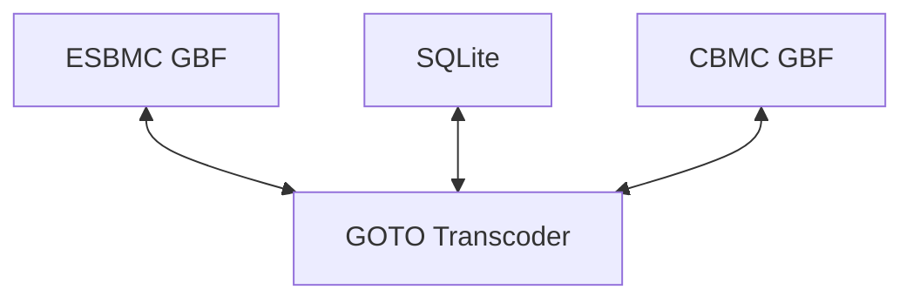

# GOTO Viewer

This project is still in early development stages.



## Goal


The goal here is to have a tool that facilitates visualizing and changing GOTO programs generated from ESBMC and CBMC by:

- Parsing the GBF (goto binary format?) from ESBMC and CBMC
- Writing GBF into an db (sqlite). 
- Writing into GBF to ESBMC/CBMC. Allowing to convert between both versions (note that this is not a compatibility layer, I expect a third-party app that will use the sqlite to adapt the program).
- Parsing a db into ESBMC/CBMC GBF.

## Format

A full GOTO program consists in a set of Symbols and a set of Functions. 

### Irep

Considering ESBMC and CBMC the most important data structure to consider is the Irep (intermediate representation?). It is a string based format that is used to contain all values from the program. As an example for the constant 42:

```
Irep {
  "id": "constant"
  "named_subt":
    "type": "unsigned_bv"
    "value": "42"
  "comment:"
    "location:" "main.c function foo"
}
```

For this project, the spec is:

```
Irep {
  id: String,
  sub: Vec<Irep>,
  named_sub: HashMap<String, Irep>,
  comment_sub: HashMap<String, Irep>
}
```

It is worth notting that both CBMC and ESBMC will not use "String", they use a string cache which is only used by reference. This is also true for the binary formats.


### Symbol

A symbol is an Irep of the form:

```
Irep {
 id = "symbol", // required
 named_subt:
   "type": <irep>, //required
   "symvalue": <irep>, // optional
   "location": <irep>, // optional
   "name": <irep>, // required
   "module": <irep>, // required
   "base_name": <irep> // required
   "mode": <irep> // required
   // TODO: flags // required
}
```

For example, an instruction `int a = 42;` in the function `foo` might generate:

```
Irep {
 id = "symbol",
 named_subt:
   "type": Irept { id = "constant_bv", "named_subt"["width"]: "4" }
   "symvalue": {id = "42" }, 
   "location": {id = "foo line 1"},
   "name": {id = "c:foo@a"}, 
   "module": {id = "foo"}, 
   "base_name": {id = "a"}
   "mode": {id = "C" } 
}
```

### Function

A Function is of the pair <String, Irept>, where the first is the function name and the second is the set of instructions (in Irep):

```
Irep {
  id = "goto-program", // required
  subt: <instructions> // optional
}
```


### ESBMC GBF

### CBMC GBF

## Intrinsic functions

ESBMC and CBMC also relies on some intrinsic functions. These need operational models (or equivalent implementations) for the translation to work properly.
Also, some are the same with different names, e.g.: `__CPROVER__start = __ESBMC_main`

### CBMC

```
_Bool __ESBMC_is_allocated[&symbol] __infinity
_Bool __ESBMC_is_free[&symbol] __infinity
size_t __ESBMC_allocated_size[&symbol] __infinity


__CPROVER__start
__CPROVER_initialize
__CPROVER_max_malloc_size
__CPROVER_size_t
__CPROVER_memory_leak
__CPROVER_object_whole
__CPROVER_dead_object
__CPROVER_object_upto
__CPROVER_deallocated
__CPROVER_object_from
__CPROVER_memory
__CPROVER_constant_infinity_uint
__CPROVER_assignable
__CPROVER_freeable
__CPROVER_is_freeable
__CPROVER_was_freed


__CPROVER_rounding_mode
__CPROVER_architecture_memory_operand_size
__CPROVER_architecture_os
__CPROVER_architecture_long_int_width
__CPROVER_architecture_int_width
__CPROVER_architecture_word_size
__CPROVER_architecture_NULL_is_zero
__CPROVER_architecture_arch
__CPROVER_architecture_endianness
__CPROVER_architecture_alignment
__CPROVER_architecture_wchar_t_is_unsigned
__CPROVER_architecture_char_is_unsigned
__CPROVER_architecture_bool_width
__CPROVER_architecture_char_width
__CPROVER_architecture_short_int_width
__CPROVER_architecture_long_long_int_width
__CPROVER_architecture_pointer_width
__CPROVER_architecture_single_width
__CPROVER_architecture_double_width
__CPROVER_architecture_long_double_width
__CPROVER_architecture_wchar_t_width
```

### ESBMC

```
__ESBMC_num_total_threads
__ESBMC_num_threads_running
__ESBMC_unreachable
__ESBMC_alloc_size
__ESBMC_alloc
__ESBMC_same_object
__ESBMC_init_object
__ESBMC_POINTER_OFFSET
__ESBMC_atomic_end
__ESBMC_atexit_handler
__ESBMC_HIDE
__ESBMC_tmp
__ESBMC_atomic_begin
__ESBMC_pthread_end_main_hook
__ESBMC_yield
__ESBMC_pthread_start_main_hook
__ESBMC_get_object_size
__ESBMC_is_dynamic
__ESBMC_POINTER_OBJECT
__ESBMC_assert
__ESBMC_memset
__ESBMC_assume
__ESBMC_rounding_mode
__ESBMC_is_little_endian
__ESBMC_bitcast
__ESBMC_memory_leak_checks
__ESBMC_main
```
